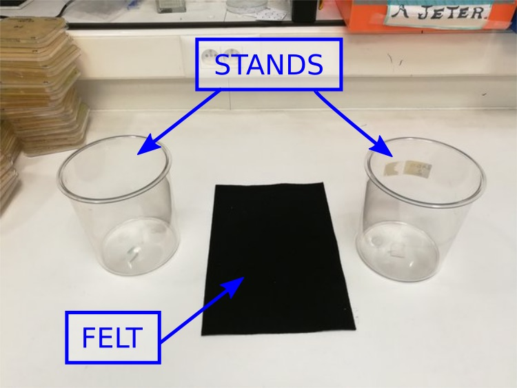
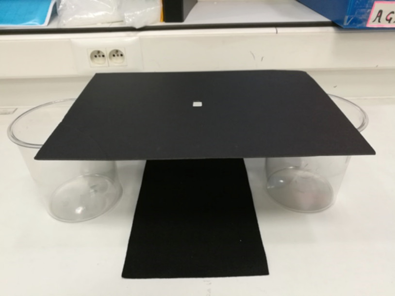
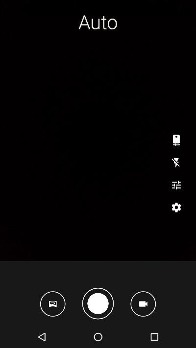
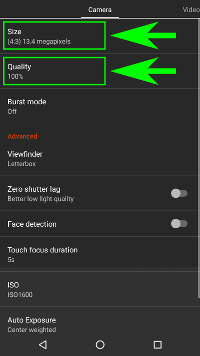
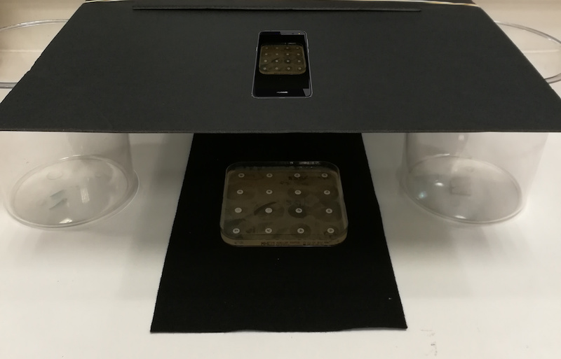



# Introduction #
This document guides you thought the process of acquiring good quality AST (Antimicrobial Susceptibility Testing) images with a smartphone or a tablet.

#  Examples #

Here you can find some examples of good and bad pictures of AST images.
The picture in the first line are good examples. The other images illustrates common mistakes.

| Examples of good pictures                  |                                            |
|:-------------------------------------------|:-------------------------------------------|
| <i class="fas fa-check"></i> Good picture. | <i class="fas fa-check"></i> Good Picture. |
| ![bad picture][good_sq]                    | ![bad picture][good_circle]                |

  

| Examples of bad pictures                        |                                                            |
|:------------------------------------------------|:-----------------------------------------------------------|
| Blurred picture, impossible to read the labels. | The Petri dish not entirely in the picture (out of frame). |
| ![bad picture][bad_blurred]                     | ![bad_picture][bad_oof]                                    |
| The background is not completely black          | Picture taken from aside. Perspective distortion.          |
| ![bad picture][bad_no_black]                    | ![bad_picture][bad_pers]                                   |
| Light reflection                                | Operator's reflection                                      |
| ![bad_picture][bad_reflex]                      | ![bad_picture][bad_op]                                     |

[bad_no_black]:images/IMG_20180130_205107.jpg
[good_sq]:images/IMG_20180107_183954.jpg
[good_circle]:images/IMG_20180107_184123.jpg
[bad_blurred]:images/IMG_20180107_183257.jpg
[bad_op]:images/IMG_20171225_182209_enhanced.jpg
[bad_oof]:images/bad_frame.jpg
[bad_pers]:images/bad_perspective.jpg
[bad_reflex]:images/bad_reflex.jpg

# Protocol #

Follow these instruction for the acquisition of AST images.

##  Materials ##

For the acquisition you will need:

- A smartphone (or tablet) with camera (resolution ≥ 12 megapixels)
- A rectangular piece of matt black [felt](https://en.wikipedia.org/wiki/Felt), the size of an A4 sheet (21x30 cm) or larger.
- A rigid sheet of matt black cardboard, the size of an A3 sheet (42 x 60 cm)  or larger.
- 2 objects that can be used as stands for the cardboard (see fig 1). Their height should be about 16 cm.

| figure 1                          |
|:----------------------------------|
|  |

##  Setup ##

Choose a bright environment to install the image acquisition setup.
Light should be uniform and diffuse. The light sources (windows, lamps) should not be too close to the AST.
It is not advisable to use a table lamp.

Put the piece of black felt (A4) on a flat surface (for example a lab bench). Position the two stands, one on each side of the felt (see fig. 1).

Make a small hole in the very center of the black cardboard (A3). The hole should be large enough for your smartphone’s camera.
Put the cardboard on top of the two stands (see fig. 2)

| figure 2                       |
|:-------------------------------|
|  |

- On your smartphone, open the camera application and do the following:
	1. deactivate the flash light.
	2. set the countdown timer to 5 seconds.
	3. select the program "AUTO"
	4. select the largest size (maximum megapixels) and the highest quality (100%). 
	

| figure 3                        |                                        |
|:--------------------------------|----------------------------------------|
|  |  |
| Mode selection                  | Camera settings                        |

Put your mobile on the cardboard (screen upside) and center the camera in the hole. Your pictures will be taken through the hole.

Take and AST and remove the plastic top cover. Position the AST on the black felt.
If the camera application is open and running, you can see the image on your smartphone’s screen.

Make sure that the picture's background is all black and that the AST is entirely in the picture.
The AST should be as large as possible in the picture, with just a small black border around.

	
| figure 4                                                 |
|:---------------------------------------------------------|
|  |

At this point you might decide to adjust the picture by changing the distance between the camera and the AST.
In order to do so you can change your cardboard stands or put something thick (like a book) under the felt.

##  Ready to take the picture ##

Look at the image on on your smartphone and compare it with those in the [example section](#examples) at the beginning of this document.
Check that:
- the AST is not out of frame
- the antibiotic labels are on focus (not blurred)
- there are no shadows or light reflection on the AST

##  Take the picture ##

Take the picture and check the quality. Zoom in on the labels to make sure that they are not blurred. 
Optimize the setup until you are satisfied with the picture quality.
By following this protocol you should be able to take pictures of the same quality as the good images in the [example section](#examples) at the beginning of this document.

After taking a picture, make sure that all the following conditions are satisfied:
   - The AST is entirely in the picture and does not touch the image borders.
   - If the AST is square, its border should be parallel to the image borders.
   - There is no strong perspective distortion.
   - The antibiotics labels are sharp and easy to read.

##  Download ##

Download the <a href="assets/downloads/Brochure_MSF_ASTapp_V6_EN.pdf"> portable PDF version</a> of this image acquisition protocol.
